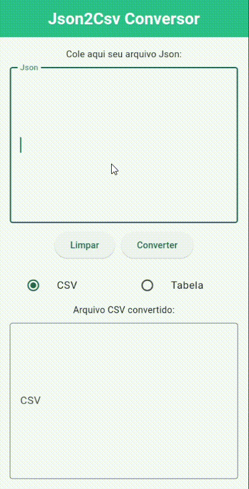

# JSON2CSV Conversor

Um conversor simples de JSON para CSV, criado em Flutter. O aplicativo permite aos usuários colar um JSON válido e gerar sua versão em formato de tabela (CSV) ou em uma visualização de tabela interativa.

---

## Funcionalidades

* Converte JSON para CSV.
* Validação de JSON inválido com mensagens de erro claras.
* Botão "Limpar" para remover o conteúdo dos campos de texto.
* Permite ao usuário escolher a visualização entre CSV e Tabela.
* Exibe os dados convertidos em um campo de texto ou em uma tabela interativa.

---

## Tecnologias

* **Flutter**: Framework para o desenvolvimento do aplicativo.
* **Dart**: Linguagem de programação.

---

## Demonstração

---

## Instalação e Execução

1.  Clone o repositório para o seu ambiente local:
    `git clone https://github.com/luisabritod/Json2Csv.git`
2.  Navegue até a pasta do projeto:
    `cd json2csv`
3.  Instale as dependências do projeto:
    `flutter pub get`
4.  Execute o aplicativo:
    `flutter run`
